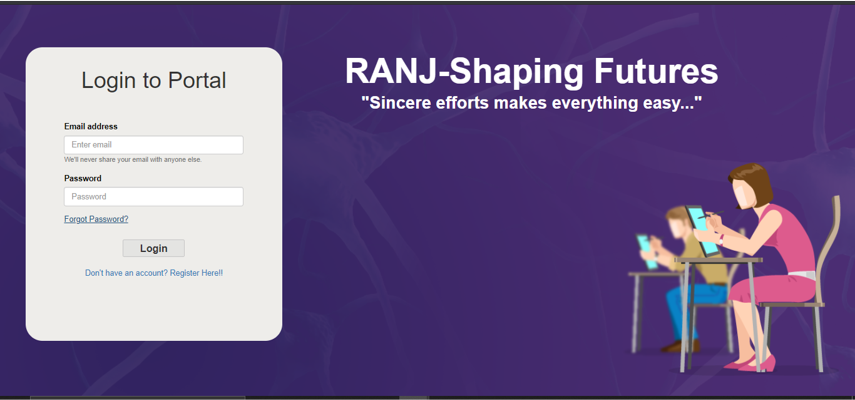
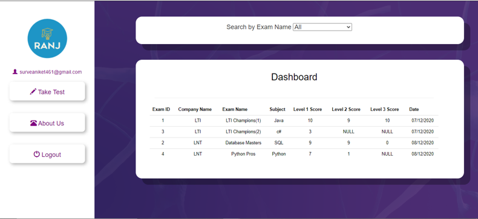
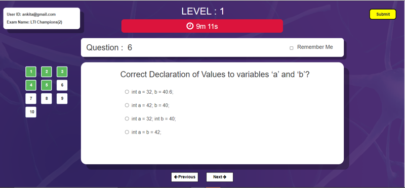
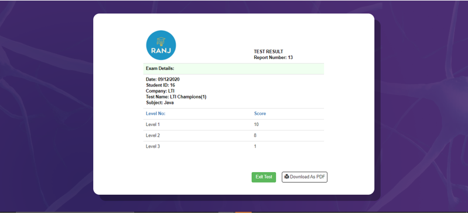
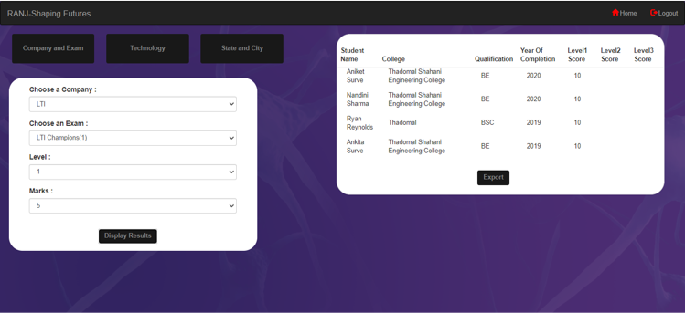

# OnlineExam

This is a project I completed in December 2020 as a part of a group with:

- [Nandini Sharma](https://github.com/Nandini0810)
- [Aniket Surve](https://github.com/Aniket461)

# Description

This is a web platform for taking Objective type technical entrance exams available for different companies under one umbrella. The exam is graded automatically and maintains a dashboard to trach student's progress. On the other hand, it gives the respective exam owners to view and filter the results based on marks, location etc. of the exam and make the best pick suited for an opening

# Features

* Login/ Registration.

* Student Dashboard.

* Test Interface.

* Result Page and Download option.

* Filter Results.

